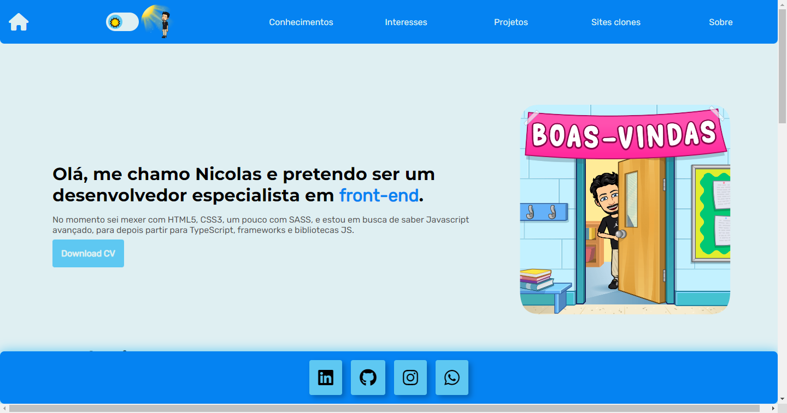
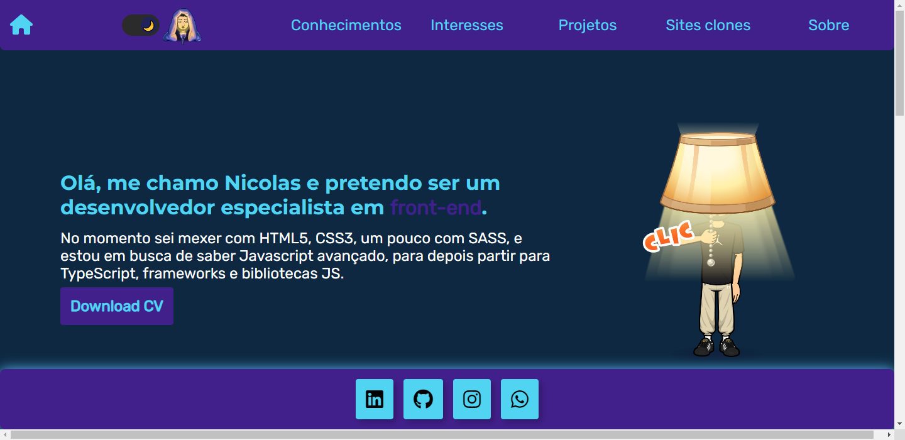

#Portfólio em construção...

<h2 class="blue__titulo">Layout mobile</h2>
<h3 style="color: #5EC8F2">Light theme</h3>
</img>
<h3 style="color: #42208C">Dark theme</h3>
</img>

<h2 class="dark__titulo">Layout desktop</h2>
<h3 style="color: #5EC8F2">Light theme</h3>
</img>
<h3 style="color: #42208C">Dark theme</h3>
</img>

<h2 class="blue__titulo">Sobre</h2>

Início de um portfólio feito com html, css e js, onde conforme vou aprendendo coisas novas, vou atualizando ele. Projetos que fiz em cursos, ou com ajuda de tutoriais estarão em outros repositórios, este é apenas para projetos feito 100% por mim, para me desafiar.

<h2 h2 class="dark__titulo">Linguagens utilizadas</h2>
<ul>
    <li>HTML</li>
    <li>CSS</li>
    <li>JavaScript</li>
</ul>

⬇️ Link para acessar o portfolio logo abaixo ⬇️

 