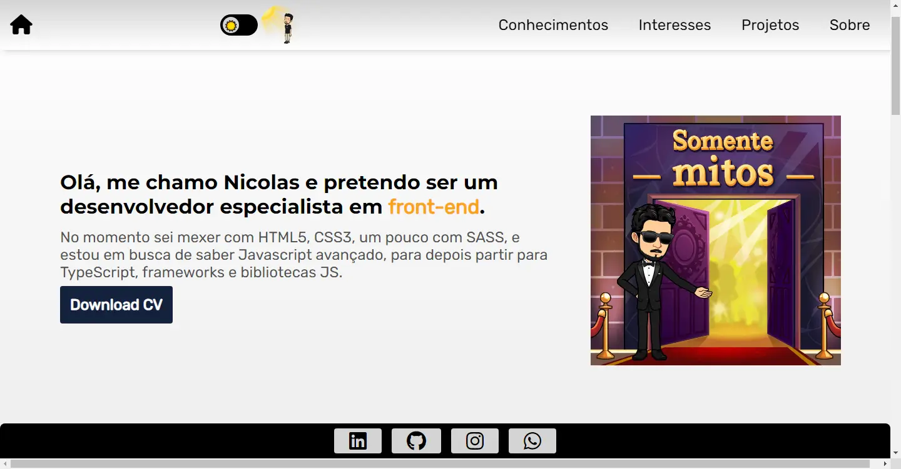

#Portfólio em construção...
<!-- <h2 
class="blue__titulo"
style="color: #0583F2; border-bottom: 3px solid #0583F2">
    Layout mobile
</h2>
<h3 style="color: #5EC8F2">Light theme</h3>
</img>
<h3 style="color: #42208C">Dark theme</h3>
</img>

 -->

<h2 
class="dark__titulo"
style="color: #0D2840; border-bottom: 3px solid #0D2840">
    Layout desktop
</h2>
<h3 style="color: #5EC8F2">Light theme</h3>
</img>
<h3 style="color: #42208C">Dark theme</h3>
</img>

<h2 
class="blue__titulo"
style="color: #0583F2; border-bottom: 3px solid #0583F2">
    Sobre
</h2>

Início de um portfólio feito com html, css e js, onde conforme vou aprendendo coisas novas, vou atualizando ele. Projetos que fiz em cursos, ou com ajuda de tutoriais estarão em outros repositórios, este é apenas para projetos feito 100% por mim, para me desafiar.

<h2
 h2 class="dark__titulo"
 style="color: #0D2840; border-bottom: 3px solid #0D2840">
    Linguagens utilizadas
 </h2>
<ul>
    <li>HTML</li>
    <li>CSS</li>
    <li>JavaScript</li>
</ul>

⬇️ Link para acessar o portfolio logo abaixo ⬇️

 